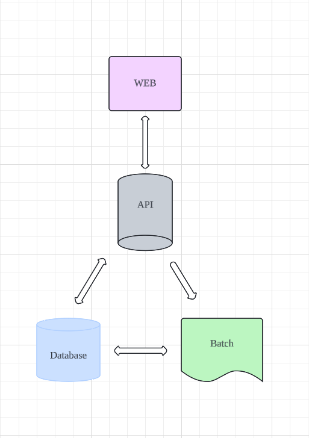
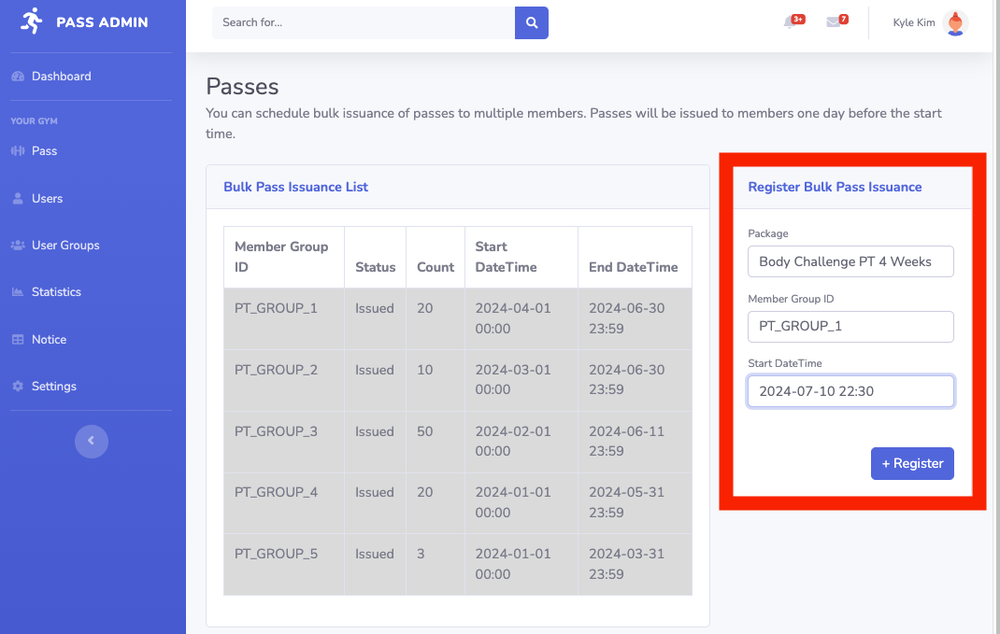
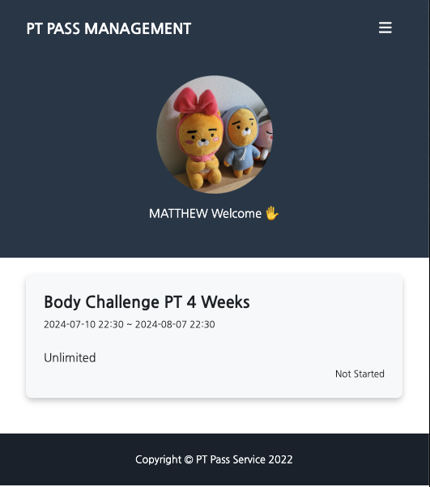
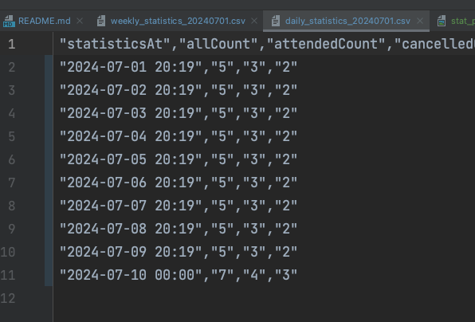
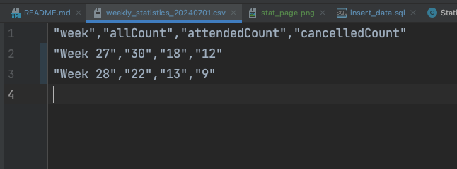

# pass-batch

This is the batch repository for the PT Subscription Management Service. It provides the following functionalities: subscription expiry, bulk subscription grant, pre-class notification, and post-class subscription deduction.

## Environments
* OpenJDK 18.0.1
* Spring Boot 2.7.3
* Gradle
* MySQL (Docker)
* JPA
* lombok
* ModelMapper


# How to Run
### step 1. Run Docker Compose
```
docker-compose up -d
```
### step 2. Run Spring Boot Application on port 8080

### step 3. Run web [front-end application](https://github.com/KyleKim107/pass-web) on port 8081

# project Overview
 - **Web** : Represents the frontend interacting with users.
- **API** : Acts as a bridge between the Web and DB/Batch components.
  - Also, it invokes the Batch jobs
- **DB (MySQL)**: Central data storage accessed by both the API and Batch.
- **Batch**: Background processing unit handling intensive tasks and periodic jobs.<br>
  

## Why Choose Spring Batch? 

- **Batch Usage**: By automating large volumes of data and repetitive tasks, you can efficiently handle them in the background. This ensures stability by allowing system recovery and re-execution from the last checkpoint in case of failures. Tasks that need to be executed periodically (e.g., checking for subscription expiration at midnight) can be easily implemented.

- **Environment**: Spring Batch integrates seamlessly with Java applications, leveraging Java's ecosystem for robust data processing capabilities. Crontab, in contrast, operates as a fundamental command on Unix and Linux systems, executing shell scripts or commands at scheduled intervals.

### Spring Batch Metadata Tables
- the tables in the Spring Batch schema are designed to support retry and transaction management for batch job executions. 
- Here’s how they contribute to these functionalities
  - Retry Management
    - Retry Works at the Point of Error
    - Retry Count and Backoff Policies
  - Transaction Management


## Process
### JOB1. Subscription Expiry
* `chunk step`
* Read the targets for subscription expiry (ExpirePassesReader) and update their status to expired (ExpirePassesWriter)
```mermaid
sequenceDiagram
    participant Batch
    participant DB
    Batch->>DB: Query subscription for each user
    activate DB
    DB->>Batch: Response with subscription for each user
    deactivate DB
    Batch->>DB: Update subscription status to expired

```

### JOB2. Bulk Subscription Grant
* `tasklet step`
* When registered by the admin, the subscriptions are granted to users at a specified time (AddPassesTasklet)
```mermaid
sequenceDiagram
    actor User
    participant DB
    participant Batch
    User->>DB: Request to register bulk subscription

    Batch->>DB: Query bulk subscription
    activate DB
    DB->>Batch: Response with bulk subscription
    deactivate DB
    Batch->>DB: Add subscription to respective users

```

### JOB3. Pre-class Notification
* `multiple thread chunk step`
* -> Parallel processing provided by Spring Batch
1. Step1: Retrieve the targets for notification
2. Step2: Send the notifications
```mermaid
sequenceDiagram
    participant Batch
    participant DB
    participant Messenger
    Batch->>DB: Query scheduled classes and users
    activate DB
    DB->>Batch: Response with scheduled classes and users
    deactivate DB
    Batch->>DB: Add notification targets
    
    Batch->>DB: Query notification targets
    activate DB
    DB->>Batch: Response with notification targets
    deactivate DB
    Batch->>Messenger: Request to send notification
    activate Messenger
    Messenger->>Batch: Notification response
    deactivate Messenger

```

### JOB4. Post-class Subscription Deduction
* `chunk step`
* UserPassesReader -> AsyncItemProcessor -> AsyncItemWriter
```mermaid
sequenceDiagram
    participant Batch
    participant DB
    Batch->>DB: Query scheduled classes and users
    activate DB
    DB->>Batch: Response with scheduled classes and users
    deactivate DB
    Batch->>DB: Deduct subscription for each user

```
## User Use Case
### AddPassesJob
- Add a bulk pass 
  - `Member Group Id` is the group id of the users who will receive the passes

- Confirm the passes to be added

- Issue the passes to the users

- Run the job
  - the batch job adds passes to the users who belong to the `Member Group Id`

- Check the result
  - the passes have been successfully added to the users 


## makeStatisticsJob 
- Check the statistics page
  - the statistics page shows the number of attendances (blue) and the number of absent (red)

- Run the job
  - the job has been successfully executed
  - retrieve booking entities that has ended date during the date range in the job parameter.

- the statistics have been successfully updated with demo data

- Export the statistics to a CSV file
  - the statistics have been successfully exported to a CSV file
  - field info
    - data and time
    - the number of attendances
    - the number of absent
    - the number of total booking

- Check the weekly statistics
  - the weekly statistics have been successfully updated with demo data
  - field info
    - the number of week in the year
    - attendances
    - absent
    - total booking
